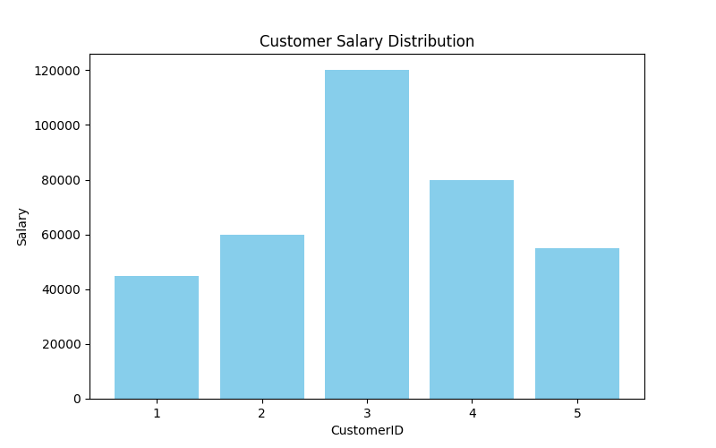
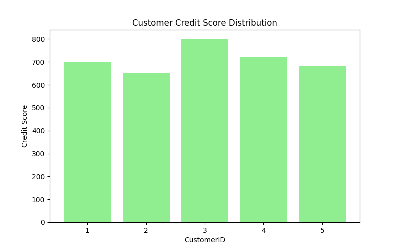
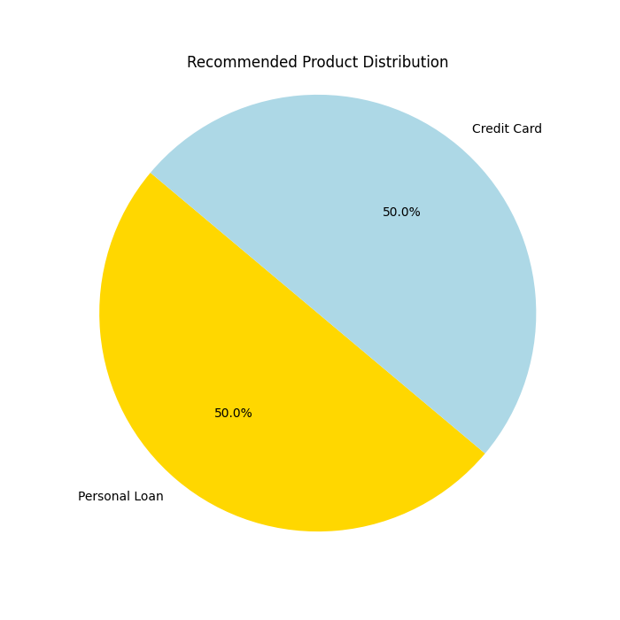

# Financial-Product-Reccomendation


# Financial Product Recommendation System

## Project Overview
This project is a content-based recommendation system that matches customers to financial products such as credit cards, personal loans, and investment accounts based on their credit score, salary, age, and existing loans. The system provides user-friendly recommendations with percentage scores and descriptive categories like "Excellent Match" or "Good Match."

---

## Key Features
- **Personalized Recommendations**: Matches customers to products based on their financial and demographic attributes.
- **Intuitive Scoring**: Outputs scores as percentages with categories like "Excellent Match."
- **Visual Insights**: Includes charts showing customer attributes and recommendation distribution.

---

## Tools and Technologies
- **Programming Language**: Python
- **Libraries**: Pandas, NumPy, Scikit-learn, Matplotlib
- **Techniques**: Content-Based Filtering, Data Normalization, Weighted Scoring

---

## Methodology
1. **Data Preparation**: 
   - Simulated datasets for customers and products.
   - Normalized customer attributes for compatibility with product requirements.

2. **Recommendation Logic**:
   - Weighted criteria:
     - Credit Score: 40%
     - Salary: 30%
     - Age: 20%
     - Existing Loans: 10%
   - Compatibility scores converted to percentages with descriptive categories.

3. **Visualization**:
   - Bar charts for customer attribute distributions.
   - Pie chart for product recommendation distribution.

---


---

## Visualizations
## Visualizations

### **1. Customer Attribute Distribution**

#### **Salary Distribution**
This bar chart shows the salary distribution across customers.



#### **Credit Score Distribution**
This bar chart illustrates the credit score distribution for all customers.



---

### **2. Product Recommendation Distribution**
The pie chart below shows the proportion of recommended products, categorized by product type (e.g., Credit Cards, Loans, Investment Accounts).



---

## Future Enhancements
- **Behavioral Data**: Incorporate customer spending patterns and transaction history.
- **Hybrid Recommendations**: Combine with collaborative filtering for improved accuracy.
- **Advanced Models**: Implement machine learning algorithms for predictive scoring.

---

## How to Run
1. Clone the repository:
   ```bash
   git clone https://github.com/yourusername/financial-product-recommender.git

